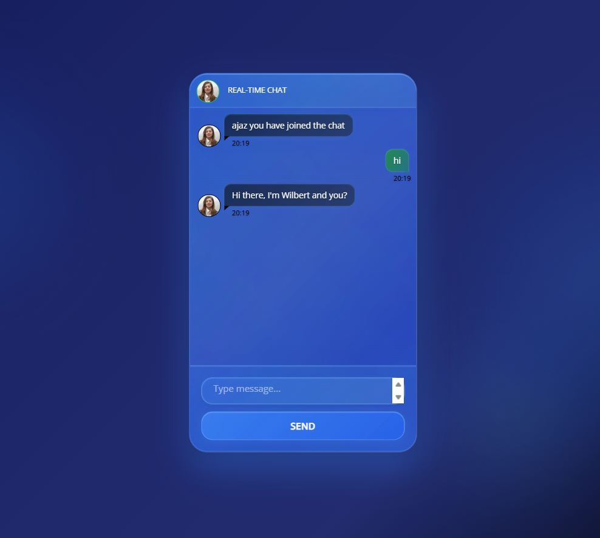

# 💬 Real-Time Chat Application

### ✨ WhatsApp-Style Dark Theme Socket.IO Chat Application ✨
*Updated: October 2025*

### 🎨 **Modern Dark Theme Preview**

*Clean, modern dark theme with WhatsApp-inspired design and real-time messaging*

### FEATURING THE FASTEST AND MOST RELIABLE REAL-TIME ENGINE ###
Real-Time Chat is powered by Socket.IO. is a web application that allows multiple users to have a private and public chat.
This app allows one to one chat online and its fast and easy to use. Please note that the application code is written in Javascript ES6.

## 🚀 **Features**

### 🌑 **Modern Dark Theme UI**
- **Clean dark background** with solid colors
- **WhatsApp-inspired message bubbles** (green for sent, gray for received)
- **Simple, intuitive interface** without distracting animations
- **Professional dark theme** perfect for any lighting condition
- **Responsive design** that works on all devices

### 💬 **Real-Time Chat Capabilities**
- **Instant messaging** powered by Socket.IO v4.7.5
- **User connection/disconnection notifications**
- **Private messaging** between users
- **Chat history logging** to file system
- **Real-time user status** indicators
- **Reliable reconnection** with fallback options

### 🎨 **WhatsApp-Style Interface**
- **Horizontal input layout** with text field and send button
- **Green send button** with arrow icon (➤)
- **Message bubbles** with proper alignment (left/right)
- **Clean typography** and optimal spacing
- **Simple placeholder text**: "Type a message..."

## 🛠 **Technology Stack**

- **Backend**: Node.js with Express.js v4.18.2
- **Real-Time Communication**: Socket.IO v4.7.5
- **Frontend**: HTML5, CSS3 with modern dark theme
- **Styling**: Custom CSS with WhatsApp-inspired design
- **Cross-Browser**: Normalize.css for consistent styling

## 📋 **Prerequisites**

Before running this application, make sure you have:

- **Node.js** (v18 or higher) - [Download](https://nodejs.org/)
- **npm** package manager (comes with Node.js)
- Modern web browser (Chrome, Firefox, Safari, Edge)
- Basic understanding of:
  - Socket.IO - [Documentation](https://socket.io/)
  - JavaScript ES6+ - [Learn More](https://developer.mozilla.org/en-US/docs/Web/JavaScript)
  - WebSockets - [MDN Guide](https://developer.mozilla.org/en-US/docs/Web/API/WebSockets_API)

## ⚡ **Quick Start**

### 🔧 **Installation**

1. **Clone or download the repository**
   ```bash
   git clone <your-repository-url>
   cd chat_application
   ```

2. **Install dependencies**
   ```bash
   npm install
   ```

3. **Start the application**
   ```bash
   npm start
   # or
   node index.js
   ```

4. **Access the chat**
   Open your browser and navigate to: **http://localhost:3001**
   
   💡 **Note**: The app runs on port 3001 by default. If you see an "EADDRINUSE" error, the port is already in use.

## 🎯 **Usage**

1. **Enter your username** when prompted by the modal
2. **Type your message** in the input field at the bottom
3. **Send messages** by clicking the green arrow button (➤) or pressing Enter
4. **View real-time messages** in WhatsApp-style bubbles
5. **Enjoy the clean dark theme** designed for comfortable chatting
6. **Connect with multiple users** for group conversations

## 🎨 **Design Details**

### **WhatsApp-Style Features:**
- **Clean dark background** (`#0d1421`) for comfortable viewing
- **Message bubbles**: Gray for received (`#374151`), green for sent (`#dcf8c6`)
- **Simple input area** with horizontal layout
- **Green send button** with arrow icon (➤)
- **No distracting animations** - focus on functionality
- **Professional appearance** suitable for any environment

### **Color Palette:**
- Background: `#0d1421` (Dark navy)
- Chat container: `#1f2937` (Dark gray)
- Message area: `#111827` (Darker gray)
- Received messages: `#374151` (Medium gray)
- Sent messages: `#dcf8c6` (WhatsApp green)
- Send button: `#10b981` (Green)
- Text: `#ffffff` (White)

## 📁 **Project Structure**

```
chat_application/
├── index.js                 # Main server file (Express + Socket.IO)
├── index.html              # Frontend HTML structure
├── package.json            # Dependencies and npm scripts
├── chat_data.txt          # Chat history storage
├── public/
│   ├── css/
│   │   ├── style.css      # WhatsApp-style dark theme
│   │   └── normalize.css  # Cross-browser CSS normalization
│   ├── js/
│   │   └── index.js       # Frontend JavaScript & Socket.IO client
│   └── img/
│       ├── favicon.ico    # Application favicon
│       └── liquid-glass-chat.png  # Screenshot
└── README.md              # Project documentation
```

## 🔧 **Configuration**

The application runs on **port 3001** by default. You can modify this in the `index.js` file:

```javascript
const PORT = process.env.PORT || 3001;
http.listen(PORT, () => {
  console.log(`Server running on port ${PORT}`);
  console.log(`click on the link:http://localhost:${PORT}`);
});
```

### **Environment Variables**
- `PORT`: Server port (default: 3001)
- Set via environment or modify in `index.js`

### **Troubleshooting**
- **Port in use error**: Change port number or kill existing process
- **Connection issues**: Check firewall settings and ensure port is open
- **Module not found**: Run `npm install` to install dependencies

## 🤝 **Contributing**

1. Fork the repository
2. Create your feature branch (`git checkout -b feature/AmazingFeature`)
3. Commit your changes (`git commit -m 'Add some AmazingFeature'`)
4. Push to the branch (`git push origin feature/AmazingFeature`)
5. Open a Pull Request

## 📝 **License**

This project is licensed under the ISC License.

## � **Security Features**

- **Input validation** and sanitization
- **XSS protection** with proper escaping
- **CORS configuration** for secure cross-origin requests
- **File system logging** for chat history
- **Connection timeout** and reconnection handling

## 🙏 **Acknowledgments**

- Socket.IO team for excellent real-time communication library
- Express.js for robust web server framework
- WhatsApp for UI/UX inspiration
- Normalize.css for cross-browser compatibility
- Open source community for various dependencies

## 📞 **Support**

If you encounter any issues or have questions:

### **Common Issues:**
- **EADDRINUSE error**: Port already in use, try different port
- **Module not found**: Run `npm install`
- **Connection failed**: Check firewall and port settings
- **Styling issues**: Clear browser cache

### **Getting Help:**
- Check the [Socket.IO documentation](https://socket.io/docs/)
- Review browser console for error messages
- Ensure Node.js version compatibility (v18+)

---

### 💬 **Enjoy your modern WhatsApp-style chat experience!** 🌑✨

**Perfect for**: Team communication, customer support, educational platforms, or any real-time messaging needs.
